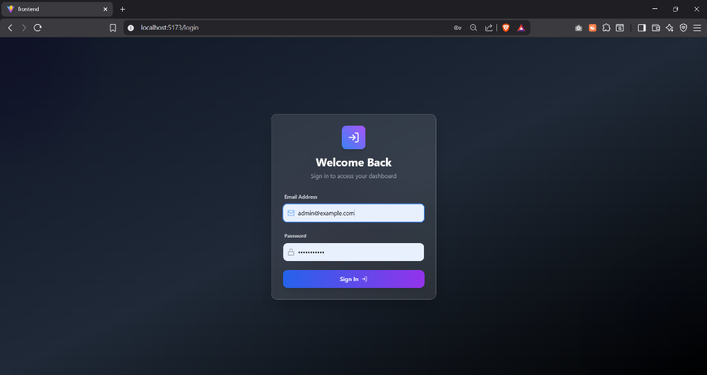
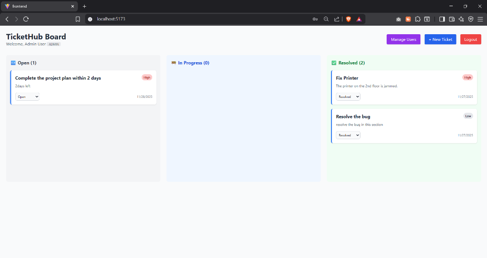
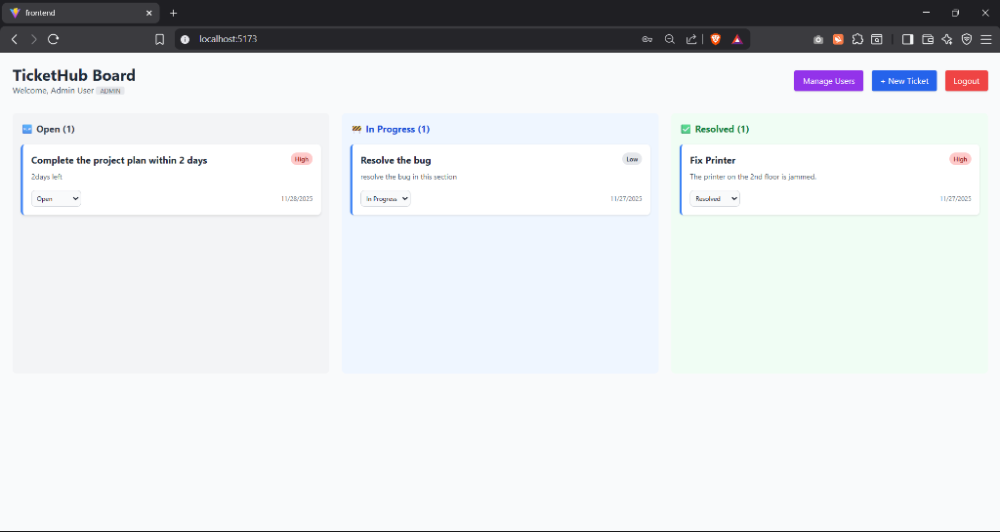
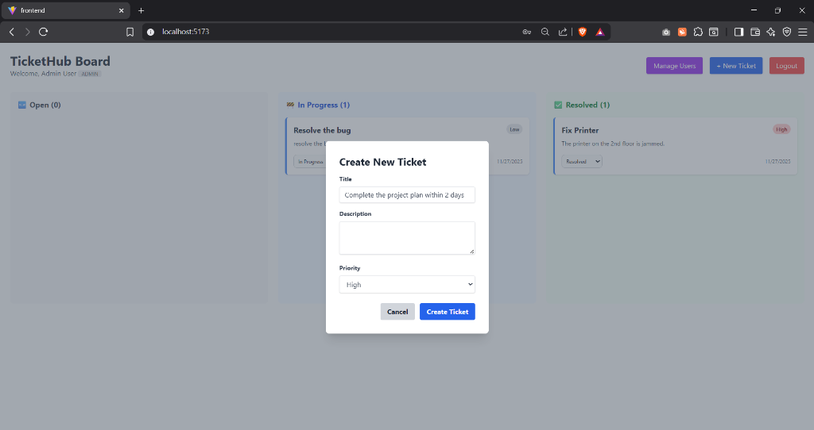
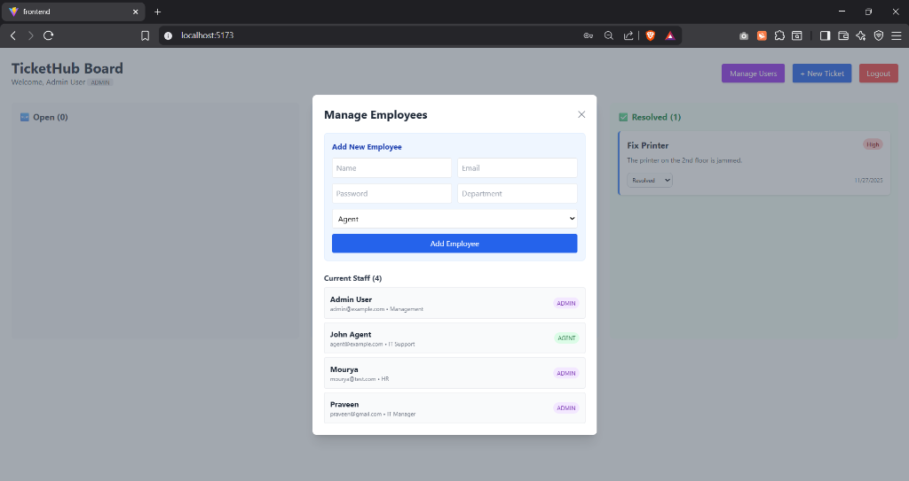
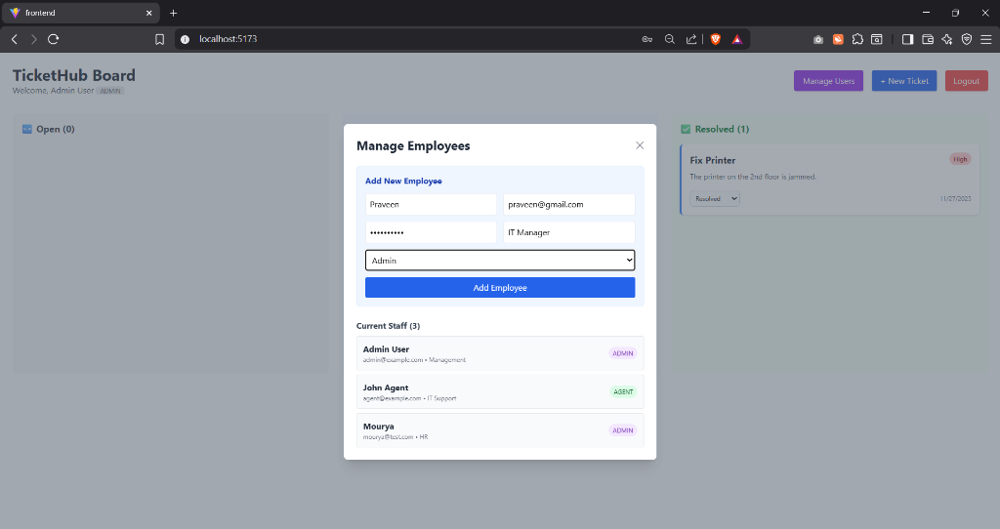

# TicketHub - IT Support Ticketing System

TicketHub is a robust IT support ticketing system designed to streamline issue tracking and resolution. Built with the MERN stack (MongoDB, Express.js, React, Node.js), it provides a seamless experience for users to report issues and for support teams to manage and resolve tickets efficiently.

---

## 🚀 Features

-   **User Authentication**: Secure login and registration using JWT and Bcrypt.
-   **Ticket Management**: Create, read, update, and delete (CRUD) support tickets.
-   **Real-time Updates**: Interactive UI with instant feedback using React Hot Toast.
-   **Responsive Design**: Fully responsive interface built with Tailwind CSS.
-   **RESTful API**: Well-structured backend API for efficient data handling.

---

## �️ Tech Stack

### Frontend
-   **React**: UI library for building interactive user interfaces.
-   **Vite**: Next-generation frontend tooling for fast builds.
-   **Tailwind CSS**: Utility-first CSS framework for rapid UI development.
-   **Axios**: Promise-based HTTP client for the browser.
-   **React Router**: Declarative routing for React applications.

### Backend
-   **Node.js**: JavaScript runtime environment.
-   **Express.js**: Fast, unopinionated web framework for Node.js.
-   **MongoDB**: NoSQL database for flexible data storage.
-   **Mongoose**: ODM library for MongoDB and Node.js.
-   **JWT (JSON Web Tokens)**: Securely transmitting information between parties.

---

## 📂 Project Structure

```bash
IT Support Ticketing System/
├── backend/                # Server-side code (Node.js/Express)
│   ├── config/             # Database configuration
│   ├── controllers/        # Request handlers
│   ├── models/             # Mongoose schemas
│   ├── routes/             # API routes
│   └── server.js           # Entry point
│
├── frontend/               # Client-side code (React/Vite)
│   ├── src/                # Source files
│   ├── public/             # Static assets
│   └── index.html          # HTML entry point
│
└── README.md               # Project documentation
```

---

## 🏁 Getting Started

Follow these steps to set up the project locally.

### Prerequisites

Ensure you have the following installed:
-   [Node.js](https://nodejs.org/) (v14 or higher)
-   [npm](https://www.npmjs.com/) (Node Package Manager)
-   [MongoDB](https://www.mongodb.com/) (Local or Atlas connection string)

### 1. Clone the Repository

```bash
git clone https://github.com/Mourya77/IT-support-ticketing-system.git
cd "IT Support Ticketing System"
```

<!-- Step Separator -->
<br>

### 2. Backend Setup

Navigate to the backend directory and install dependencies:

```bash
cd backend
npm install
```

**Configuration:**
Create a `.env` file in the `backend` directory with the following variables:

```env
NODE_ENV=development
PORT=5000
MONGO_URI=your_mongodb_connection_string
JWT_SECRET=your_secret_key
```

**Start the Server:**

```bash
# Run in development mode (with nodemon)
npm run dev

# Or run in production mode
npm start
```

*The backend server will start on `http://localhost:5000`.*

<!-- Step Separator -->
<br>

### 3. Frontend Setup

Open a new terminal, navigate to the frontend directory, and install dependencies:

```bash
cd frontend
npm install
```

**Start the Application:**

```bash
npm run dev
```

*The frontend application will start on `http://localhost:5173` (or the port shown in the terminal).*

---

## 📡 API Endpoints

The backend exposes the following RESTful API routes (prefixed with `/api`):

-   **Auth Routes**: `/api/users` (Register, Login)
-   **Ticket Routes**: `/api/tickets` (Create, Get, Update, Delete tickets)

---

## 🤝 Contributing

Contributions are welcome! Please fork the repository and submit a pull request for any enhancements or bug fixes.

1.  Fork the Project
2.  Create your Feature Branch (`git checkout -b feature/AmazingFeature`)
3.  Commit your Changes (`git commit -m 'Add some AmazingFeature'`)
4.  Push to the Branch (`git push origin feature/AmazingFeature`)
5.  Open a Pull Request

---

## 📸 Screenshots

### Login Page


### Dashboard Overview


### Ticket Management


### Create Ticket


### User Management


### Add Employee

